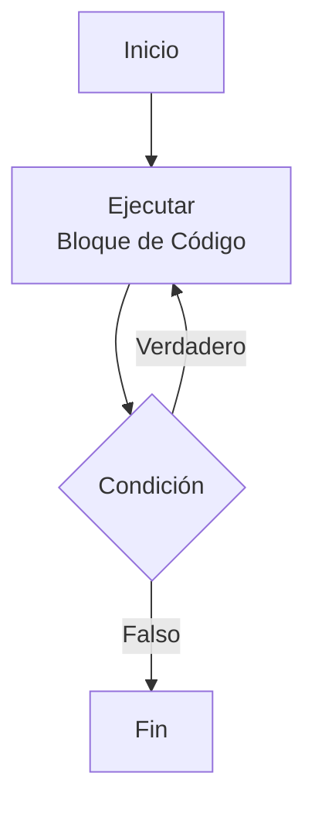
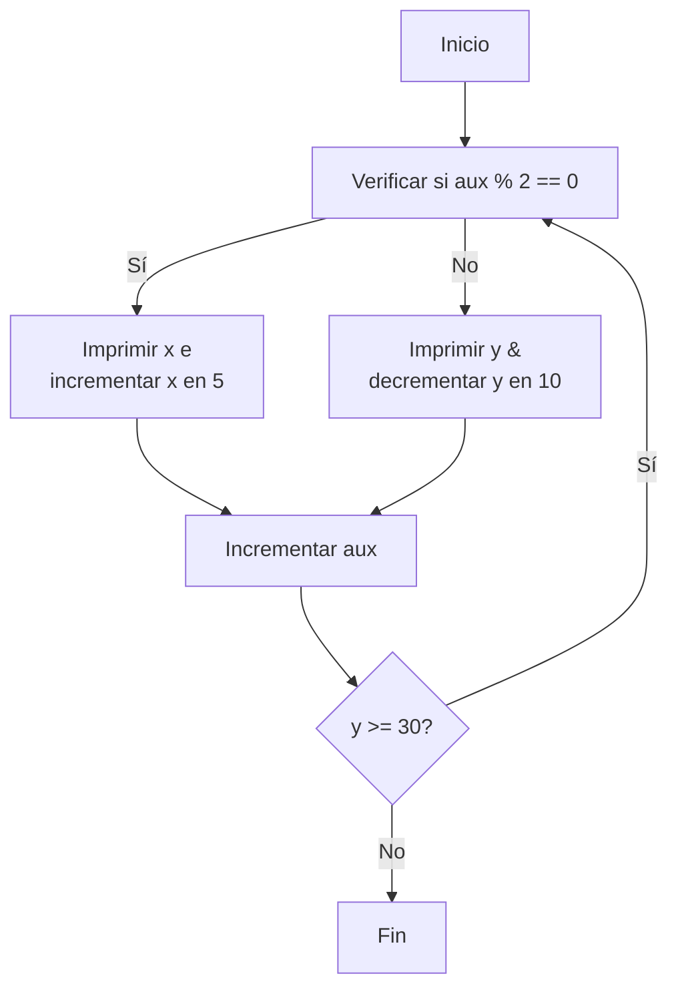
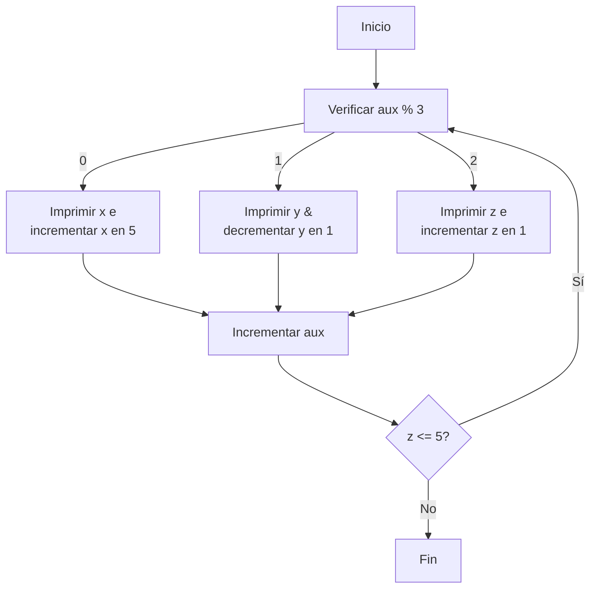
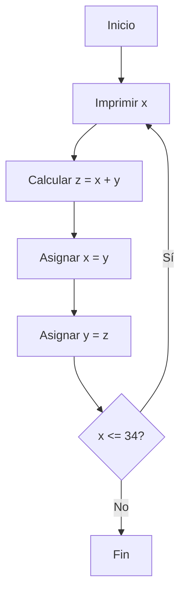

# Sebastian Munzón

## Sudamericano

### Cuenca, 7 de Enero de 2024

# Marco Teórico

En los ejercicios se uso el bucle **Do While**.

# Objetivo

- ## Primer Caso -> 0 100 5 90 10 80 15 70 20 60 25 50 30 35
  Esta secuencia alterna entre incrementar un valor en 5 y decrementar otro en 10, dependiendo de si la variable auxiliar es par o impar.

---

- ## Segundo Caso -> 0 99 1 5 98 2 10 97 3 15 96 4 20 95 5

  Esta secuencia realiza tres operaciones según el resto de dividir la variable auxiliar entre 3:

  - Imprime e incrementa x en 5 si el resto es 0.
  - Imprime y decrementa y en 1 si el resto es 1.
  - Imprime e incrementa z en 1 si el resto es 2.
  -

---

- ## Tercer Caso -> 0 1 1 2 3 5 8 13 21 34
  Esta secuencia genera números de Fibonacci sumando los dos valores previos.

