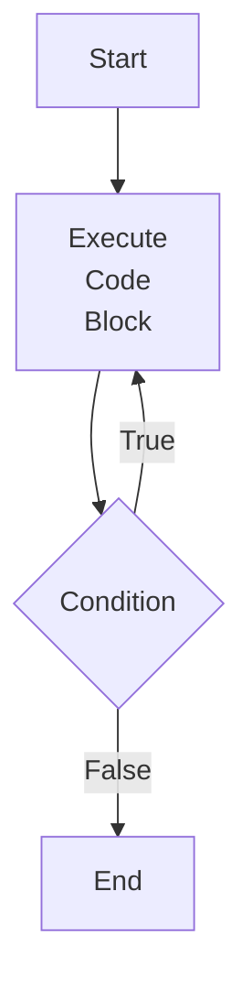
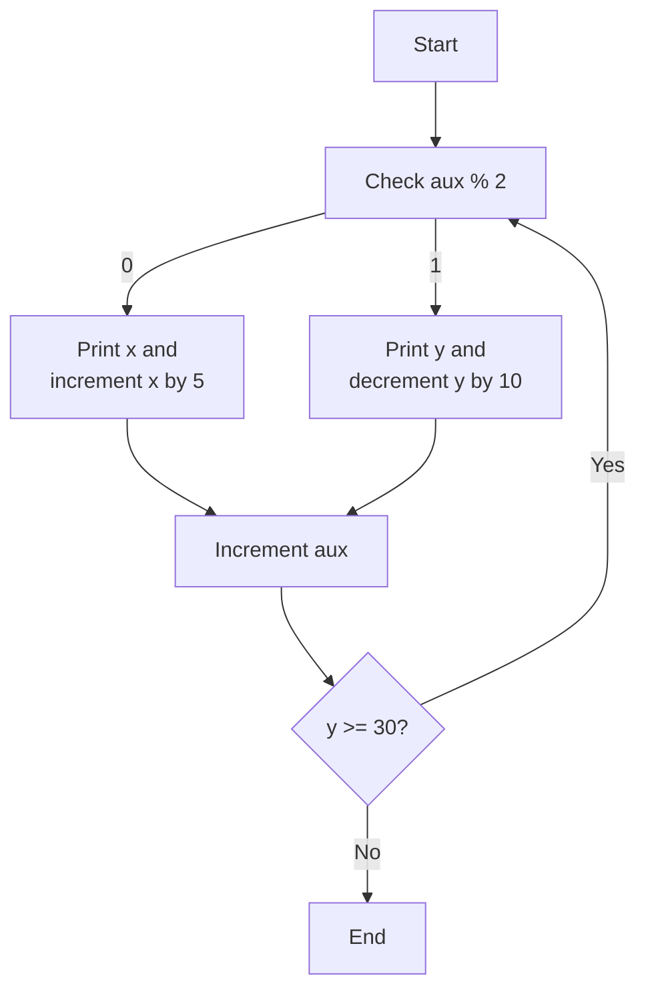
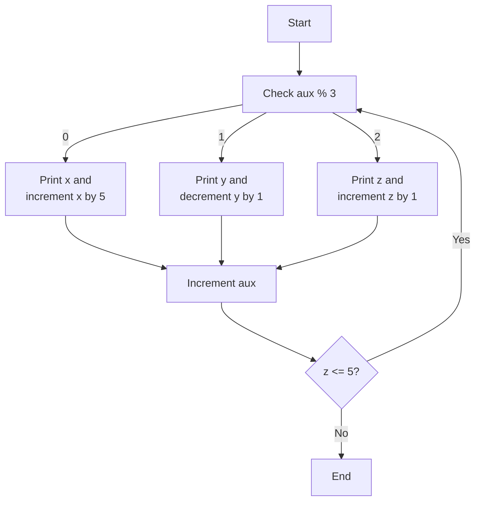
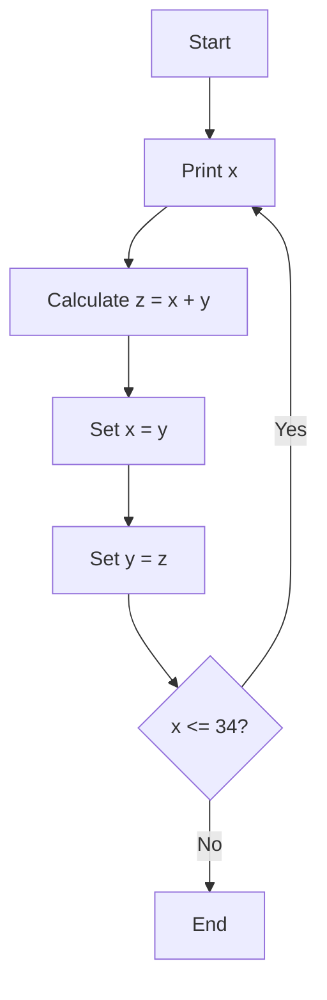

# Sebastian Munzón

## Sudamericano

### Cuenca, 7 de Enero de 2024

# Marco Teórico

En los ejercicios se uso el bucle **Do While**.

# Objetivo

- ## Primer Caso
  - 0 100 5 90 10 80 15 70 20 60 25 50 30 35

---

- ## Segundo Caso
  - 0 99 1 5 98 2 10 97 3 15 96 4 20 95 5

---

- ## Tercer Caso
  - 0 1 1 2 3 5 8 13 21 34

